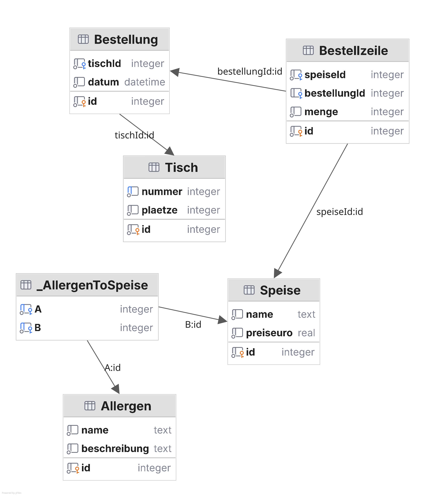

# Praktische Leistungsfeststellung 5AHWII

## Thema Datenmodellierung

### ER Diagramm für ein Restaurant

 

### Anmerkungen zu den Beziehungen

Speise <-> Allergen: Eine Speise kann mehrere Allergene enthalen und ein bestimmtes
Allergen kann in mehreren Speisen enthalten sein.

Bestellung -> Tisch: Eine Bestellung gehört zu einem bestimmten Tisch

Bestellzeile -> Bestellung: Eine Bestellung hat mehrere Zeilen, in welchen jeweils auch die
Menge der jeweiligen Speisen erfasst werden. Jede Bestellzeile gehört einer bestimmten
Bestellung

Bestellzeile -> Speise: Eine Bestellzeile hat genau eine Speise, nicht umgekehrt.

### Aufgabe 1: Prisma Schema (~30min, genügend)

Erstelle ein Prisma Schema, welches die Beziehungen abbildet.

### Aufgabe 2: SQL-DDL (10min, befriedigend)

Generiere (i.e. "lass generieren") die nötigen SQL Statements, um die nötigen Tabellen,
Indices und Constraints für dieses Datenmodell in einer SQL Datenbank anzulegen!

### Aufgabe 3: Seeding (gut, sehr gut)

Denke Dir ein Restaurant Deiner Wahl aus und befülle die Datenbank soweit die Zeit reicht.
nimm Dir dazu fakerjs.dev zu Hilfe (Kategorie "food")
